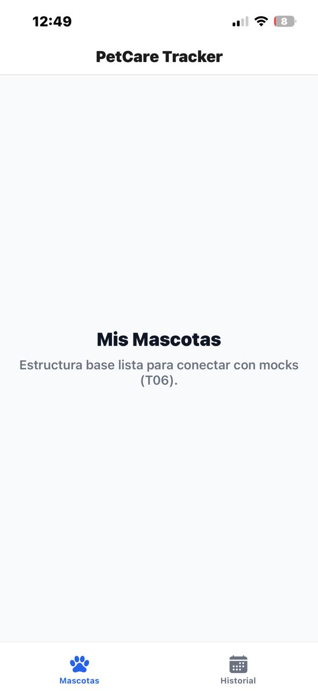

# 📄 Documento de Proceso: PetCare Tracker

**Materia:** Taller Complementario – React Native II  
**Integrantes:** Perez Anahi - Ramirez Luana  
**Metodología:** Spec-Driven Development (SDD)  
**Repositorio:** [Repositorio de GitHub](https://github.com/RamzLu/actividad1-petCare-ReactNative)

---

## 1. Investigación en Equipo (Etapa 1)

### React Native & Expo

- **React Native:** Framework que permite construir aplicaciones móviles usando JavaScript y React. Resuelve el problema de desarrollo multiplataforma compilando a componentes nativos en lugar de renderizar en un WebView.
- **Diferencias:** A diferencia del desarrollo nativo (Kotlin/Swift), permite un único código base. A diferencia de apps híbridas web (Ionic/PWA), React Native no usa un navegador embebido, sino un puente (JSI/Bridge) que comunica JavaScript con la interfaz nativa del teléfono.
- **Apps conocidas:** Instagram, Discord, Shopify.
- **Expo:** Conjunto de herramientas sobre React Native que simplifica la configuración y prueba. **Expo Go** es un cliente que ejecuta el bundle de JS directamente en el teléfono sin compilar binarios nativos en cada iteración. **`expo-router`** maneja la navegación basada en archivos.

### Spec-Driven Development (SDD)

- **SDD vs. Vibe Coding:** En lugar de solicitar código sin estructura previa ("vibe coding"), SDD define formalmente las especificaciones, reglas, planes técnicos y tareas antes de escribir código. La IA actúa como un ejecutante guiado por reglas estrictas.
- **Flujo SDD:** Reglas del Proyecto (`AGENTS.md`) ➔ Especificación (`spec.md`) ➔ Plan Técnico (`plan.md`) ➔ Tareas (`tasks.md`) ➔ Implementación atómica.

### Mocks

- Un **Mock** simula respuestas de un servidor. Se utilizan funciones asíncronas con `Promise` y `setTimeout` (500ms-1000ms) para simular latencia de red y obligar a la UI a manejar estados de carga y vacío.

---

## 2. Especificación y Modificaciones (Etapa 2)

### Idea Original del Proyecto

**PetCare Tracker:** App móvil para gestión de salud de mascotas (Mis Mascotas, Registro de Turnos/Vacunas, Ficha Médica y Formulario de Alta).

### Prompts Utilizados para Generar la Spec

> **Prompt:** "Genera la especificación `spec.md` para un Tracker de Salud de Mascotas con 4 pantallas: Mis Mascotas, Registro de Turnos, Detalle de Ficha Médica y Formulario con validación. Incluye Historias de Usuario, Criterios de Aceptación, Estados (carga/vacío) y Fuera de Alcance."

### Auditoría y Correcciones Manuales

- **Propuesta original de la IA:** Dejaba fuera del alcance la gestión de archivos e imágenes locales.
- **Ajuste del equipo:** Se **modificó el alcance** para habilitar la selección de fotos de perfil desde la galería local del dispositivo (`expo-image-picker`), considerando clave el impacto visual en la ficha de cada mascota.

---

## 3. Plan Técnico y Tareas (Etapa 3)

### Prompts Utilizados para Plan y Tareas

> **Prompt 1:** "Genera el plan técnico `plan.md` en base a la spec ajustada. Incluye arquitectura de directorios con `expo-router`, componentes reutilizables, modelo de datos y la integración de `expo-image-picker`."
>
> **Prompt 2:** "Genera la lista de tareas `tasks.md` ordenadas, atómicas y verificables para ejecutar de a una a la vez."

### Auditoría y Correcciones Manuales

- Se estructuraron **13 tareas atómicas** divididas en 7 fases.
- Se contempló una capa `services/` con latencia simulada y componentes específicos para los estados `LoadingState` y `EmptyState`.

---

## 4. Preparación del Entorno (Etapa 4)

### Setup Realizado

- **Node.js LTS** instalado y proyecto inicializado con `npx create-expo-app`.
- **Prueba en Expo Go:** Verificado y corriendo en los dispositivos físicos del equipo.
- **Control de versiones:** Repositorio Git inicializado con la estructura base.

### Skills de IA Evaluadas e Instaladas

1. **React Native & Expo Best Practices:** Reglas para forzar componentes nativos (`<View>`, `<Text>`) evitando etiquetas HTML.
2. **Expo Router File-based Navigation:** Manejo de rutas relativas y parámetros dinámicos (`[id].jsx`).
3. **Async Mock Simulation:** Manejo de `useState` de `loading` en vistas con peticiones simuladas.

---

## 5. Desarrollo Guiado por Tareas (Etapa 5)

### Divisón del Trabajo

- **Luana Ramirez:** Pantalla 1 (Mis Mascotas) y Pantalla 2 (Historial).
- **Anahi Perez:** Pantalla 3 (Ficha Médica) y Pantalla 4 (Formulario de Alta / Registro).

---

### T01 - Navegación Base con Expo Router

- **Prompt utilizado:**

  > "¡Perfecto! Vamos a comenzar con el ciclo de desarrollo. Por favor, genera únicamente el código necesario para resolver la tarea T01 de nuestro tasks.md:
  > TAREA: T01 - Navegación base con Expo Router
  > DESCRIPCIÓN: Configurar la estructura de navegación con expo-router definiendo el Layout Raíz (app/\_layout.jsx) y el Tab Bar principal (app/(tabs)/\_layout.jsx) con pestañas para 'Mascotas' e 'Historial'."

- **Código generado:**
  1. `app/_layout.jsx`: `Stack` raíz global que oculta el header para las pestañas y define rutas modales.
  2. `app/(tabs)/_layout.jsx`: `Tabs` navigator estilizado con iconos de `Ionicons` (`paw` y `calendar`).
  3. `app/(tabs)/index.jsx` y `app/(tabs)/records.jsx`: Vistas iniciales con componentes nativos.

- **Correcciones / Dificultades:**
  - **Punto de entrada:** Se corrigió el error `ConfigError: Cannot resolve entry file` añadiendo `"main": "expo-router/entry"` en `package.json`.
  - **Grupos de rutas:** Se renombró `app/tabs/` a `app/(tabs)/` para el correcto agrupamiento sin alteración de la URL.

- **Verificación:** Navegación fluida entre solapas en Expo Go.

---

### T02 - Capa de Mocks y Servicios Simulados

- **Prompt utilizado:**

  > "Avanzamos con la Tarea T02: Capa de Mocks y Servicios Simulados. REQUISITOS: 1. Crear `services/mockData.js`. 2. Crear `services/petService.js` (`getPets`, `getPetById`, `addPet`) con Promesas y `setTimeout` (800ms). 3. Crear `services/recordService.js` (`getRecords`, `getRecordById`, `getRecordsByPetId`, `addRecord`) con `setTimeout` (800ms)."

- **Código generado:**
  1. `services/mockData.js`: Datos estáticos iniciales de mascotas y registros.
  2. `services/petService.js` y `services/recordService.js`: Operaciones CRUD simuladas sobre variables mutables en memoria.

- **Verificación:** Impresión en consola de los datos recuperados tras 800ms de latencia en `useEffect`.

---

### T03 - Componentes para Estados de Carga y Vacío

**Prompt utilizada**
¡La Tarea T02 fue verificada y guardada en Git con éxito!

Pasemos a la Tarea T03 de nuestro tasks.md: "Componentes para Estados de Carga y Vacío".

REQUISITOS DE LA TAREA T03:

1. Crear `components/LoadingState.jsx`:
      - Componente reutilizable para mostrar un indicador visual de carga mientras se resuelven las Promesas de los mocks.
      - Debe usar `ActivityIndicator` de React Native y aceptar un mensaje opcional por props.

2. Crear `components/EmptyState.jsx`:
      - Componente reutilizable para mostrar cuando un listado no devuelve resultados.
      - Debe incluir un icono (`Ionicons`), un título, un mensaje descriptivo y un botón opcional de acción (`Pressable`).

REGLAS DE DESARROLLO:

- Usar únicamente componentes nativos de React Native (`View`, `Text`, `ActivityIndicator`, `Pressable`, `StyleSheet`).
- Prohibido usar etiquetas HTML web (`div`, `span`, `p`, `button`).
- Código completo, limpio y documentado para la defensa oral.
- Indicar la ruta exacta de cada archivo antes de su bloque de código.
- Incluir la sección correspondiente para agregar a `PROCESO.md` y los comandos Git del commit.
- No avances a la Tarea T04.

- **Archivos creados:**
  - `components/LoadingState.jsx`: Indicador con `ActivityIndicator`.
  - `components/EmptyState.jsx`: Mensaje visual con icono y botón Call-to-Action.
- **Detalles técnicos:** Reutilización transversal en vistas de listas sin dependencia de librerías de terceros.

---

### T04 / T05 / T06 - Pantalla Principal y Tarjetas de Mascotas

**Prompt utilizado**
Pasemos a la Tarea T04 de nuestro tasks.md: "Pantalla Principal y Listado de Mascotas (Pantalla 1)".

REQUISITOS DE LA TAREA T04:

1. Implementar la pantalla en `app/(tabs)/index.jsx`:
   - Consumir el servicio `getPets()` de `services/petService.js` dentro de un `useEffect` al montar la vista.

   - Mostrar el componente `<LoadingState message="Cargando tus mascotas..." />` mientras la promesa esté pendiente.

   - Mostrar el componente `<EmptyState />` si no existen mascotas, configurando el botón de acción para navegar a `/pets/new`.

   - Renderizar las mascotas con un `FlatList` cuando la lista contenga elementos, incluyendo soporte para recargar la lista mediante `refreshControl` (pull-to-refresh) opcional o al reenfoque.

2. Diseñar la Tarjeta de Mascota (PetCard):
   - Mostrar la imagen de la mascota (`Image`), nombre, especie, raza y edad.

   - Permitir presionar la tarjeta (`Pressable`) para navegar a la pantalla de detalle (`/pets/[id]`).

3. Botón para Agregar Mascota:
   - Incluir un botón accesible en la cabecera o un botón flotante (FAB) que redirija a `/pets/new`.

REGLAS DE DESARROLLO:

- Usar únicamente componentes nativos de React Native (`View`, `Text`, `FlatList`, `Image`, `Pressable`, `StyleSheet`) y de `expo-router` (`useRouter` / `Link`).

- Prohibido usar etiquetas HTML web (`div`, `span`, `p`, `button`).

- Código completo, limpio y con comentarios explícitos para la defensa oral.

- Indicar la ruta exacta de cada archivo antes de su bloque de código.

- Incluir la sección correspondiente para agregar a `PROCESO.md` y los comandos Git del commit.

- No avances a la Tarea T05.

- **Archivos creados/modificados:**
  - `components/PetCard.jsx`: Tarjeta con diseño responsive (foto, nombre, especie, raza, edad, peso).
  - `app/(tabs)/index.jsx`: Consumo de `getPets()`, integración de `FlatList`, `RefreshControl` y botón flotante de alta.

---

### T10 / T11 / Refactor - Edición de Mascotas, Formateo e Imágenes

**Prompt utilizado**
¡Excelente trabajo con la Tarea T05! Ahora vamos a realizar una mejora en la experiencia de usuario (Refactor UX) sobre el formulario de alta de mascota en `app/pets/new.jsx`.

OBJETIVO DEL REFACTOR:
Sustituir el campo de entrada de texto para la URL de la foto (`TextInput`) por una integración nativa con la galería del dispositivo utilizando el módulo `expo-image-picker`.

REQUISITOS TÉCNICOS:

1. Instalación y Configuración:
      - Utilizar `expo-image-picker` para solicitar permisos de acceso a la biblioteca de imágenes.

2. UI / UX para la Selección de Foto:
      - Reemplazar el `TextInput` de la foto por un componente interactivo (`Pressable`).
      - Si no se ha seleccionado ninguna foto, mostrar una vista previa por defecto o un recuadro con un icono de cámara/galería (`Ionicons`) y un texto como "Seleccionar foto de la galería".
      - Si el usuario selecciona una imagen de su galería, mostrar la vista previa (`Image`) de la foto elegida con la posibilidad de cambiarla.

3. Lógica de Negocio:
      - Crear una función asíncrona `pickImage` que invoque `ImagePicker.launchImageLibraryAsync` con opciones para editar/recortar la imagen (ej: `aspect: [1, 1]`, `quality: 0.8`).
      - Al guardar la mascota, enviar el URI local obtenido (`result.assets[0].uri`) o la foto por defecto si el usuario no seleccionó ninguna.

REGLAS DE DESARROLLO:

- Código completo, actualizado y listo para reemplazar en `app/pets/new.jsx`.
- Incluir la orden del comando de terminal necesario para instalar `expo-image-picker` (`npx expo install expo-image-picker`).
- Indicar la ruta exacta del archivo.
- Incluir el bloque actualizado para agregar a `PROCESO.md` y los comandos Git correspondientes.

- **Cambios realizados:**
  - **Integración de Galería:** Uso de `expo-image-picker` para reemplazar inputs de texto URL por selección nativa de fotos.
  - **Módulo de Edición (`app/pets/[id]/edit.jsx`):** Pantalla de modificación con carga previa y actualización vía `updatePet`.
  - **Formateo Inteligente:** Restricción de entrada a datos numéricos (`keyboardType="numeric"` / `"decimal-pad"`) con concatenación automática ("12.5 kg", "3 años").

### Mejora - Eliminación de Mascotas con Confirmación Nativa

- **Archivos modificados:**
  - `services/petService.js`: Función asíncrona `deletePet` con simulación de latencia de red.
  - `components/PetCard.jsx`: Botón de acción con icono de papelera y aislamiento de eventos mediante `stopPropagation`.
  - `app/(tabs)/index.jsx`: Diálogo nativo `Alert.alert` con estilo destructivo y actualización del estado local.
- **Detalles técnicos y defensibilidad:**
  - Control de propagación de eventos para evitar navegación no deseada al pulsar botones anidados en la tarjeta.
  - Transición fluida a `EmptyState` cuando la lista se vacía por completo.
- **Corrección de Errores de la IA durante este bloque:**
  1. **Código Truncado en `app/pets/new.jsx`:** La IA cortó el archivo a mitad de la plantilla JSX. Se completó manualmente la estructura del formulario.
  2. **Acoplamiento de Estilos:** La IA asumió que `new.jsx` leía los estilos de `edit.jsx`. Se independizó el objeto `styles` en cada archivo.
  3. **Propagación de Eventos (`PetCard.jsx`):** Se agregó `e.stopPropagation()` al botón de edición para evitar que abra la ficha de detalle al hacer clic en el lápiz.
  4. **Parseo Robusto:** Se añadieron resguardos con RegEx para evitar errores `NaN` cuando la edad o el peso vienen sin valor inicial.

### T08 - Implementación de la Pantalla Historial Médico (Pantalla 2)

**Prompt utilizado:**
¡Avanzamos con la Tarea T08!

Por favor, genera el código completo para la Tarea T08: Implementación de la Pantalla Historial:

- Archivo: `app/(tabs)/records.jsx`
- Debe consumir `recordService.getRecords()` y `petService.getPets()`.
- Implementar filtros por tipo de atención (Todas, Vacuna, Desparasitación, Consulta) y selector por mascota.
- Manejar estados de carga con `LoadingState` y estado vacío con `EmptyState`.
- Renderizar la lista de registros con `FlatList` utilizando `RecordItem` e incluir `RefreshControl`.
- Incluir un botón flotante (FAB) o acceso rápido para crear nuevos registros si aplica.
- Agrega comentarios didácticos explicativos en el código.

- **Archivos modificados:**
  - `app/(tabs)/records.jsx`: Integración completa de la vista de historial consumiendo `getRecords()` y `getPets()`, ordenamiento cronológico por fecha, filtros combinados por tipo de atención y por mascota, manejo de estados con `LoadingState`/`EmptyState`, y `FlatList` con pull-to-refresh.
- **Detalles técnicos y defensibilidad:**
  - Resolución asíncrona concurrente de promesas con `Promise.all` para reducir el tiempo total de carga.
  - Renderizado condicional sofisticado con tres escenarios de estado: Loading, Absolute Empty (base de datos vacía) y Relative Empty (lista filtrada sin resultados).
- **Resultado de la prueba:** Verificado exitosamente en Expo Go. Los filtros actualizan la UI en tiempo real.

### Mejora - Eliminación en Cascada de Registros Médicos

- **Archivos modificados:**
  - `services/recordService.js`: Función `deleteRecordsByPetId(petId)` para depurar registros dependientes en memoria.
  - `services/petService.js`: Integración de la llamada a `deleteRecordsByPetId` dentro del flujo asíncrono de `deletePet`.
  - `app/(tabs)/index.jsx`: Actualización del diálogo de confirmación informando la baja conjunta de la mascota y su historial médico.
- **Detalles técnicos y defensibilidad:**
  - Preservación de la integridad referencial en capa de servicios mock evitando registros huérfanos en la base de datos simulada.
- **Resultado de la prueba:** Eliminación sincronizada verificada en Expo Go entre la lista de mascotas y la solapa de historial.

**Prompt utilizado:**
¡Hola! Encontré un detalle en la lógica de eliminación: cuando se elimina una mascota, sus registros e historial médico siguen apareciendo en la solapa de "Historial". Necesitamos implementar una eliminación en cascada para que también se borren sus registros asociados.

Por favor, genera las modificaciones necesarias en los siguientes archivos:

1. `services/recordService.js`:
      - Agregar la función asíncrona `deleteRecordsByPetId(petId)` que filtre y elimine del estado mutable `recordsState` todos los registros donde `record.petId === petId`.

2. `services/petService.js`:
      - Importar y ejecutar `deleteRecordsByPetId` dentro de `deletePet(id)` (o coordinar la llamada) para garantizar que la eliminación de la mascota también limpie sus registros médicos simulados.

3. `app/(tabs)/index.jsx`:
      - Asegurar que al confirmar el borrado de una mascota desde la Pantalla 1, se ejecute la eliminación completa para que en la Pantalla 2 (Historial) ya no figuren turnos o vacunas de esa mascota.

## Por favor, incluye comentarios didácticos en el código explicando el concepto de "eliminación en cascada".

## 6. Conclusiones

1. **Efectividad de SDD:** Mantener un flujo estricto de especificación, plan técnico y ejecución tarea por tarea evitó código innecesario o inconsistencias arquitectónicas comunes al trabajar de forma directa con IA.
2. **Control sobre la IA:** La auditoría continua permitió detectar fallos críticos a tiempo, tales como código truncado, dependencias de estilos no declaradas y eventos no aislados.
3. **Experiencia de Usuario en React Native:** La combinación de componentes nativos (`expo-image-picker`), navegación declarativa (`expo-router`) y retroalimentación visual ante latencias simuladas (`LoadingState`) dio como resultado una aplicación fluida y fiel a los estándares móviles actuales.
